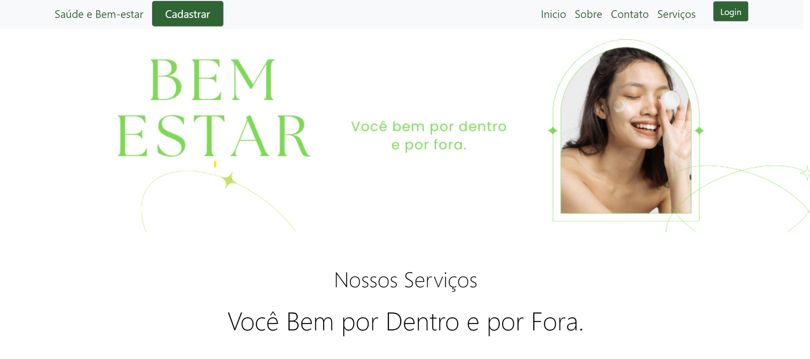
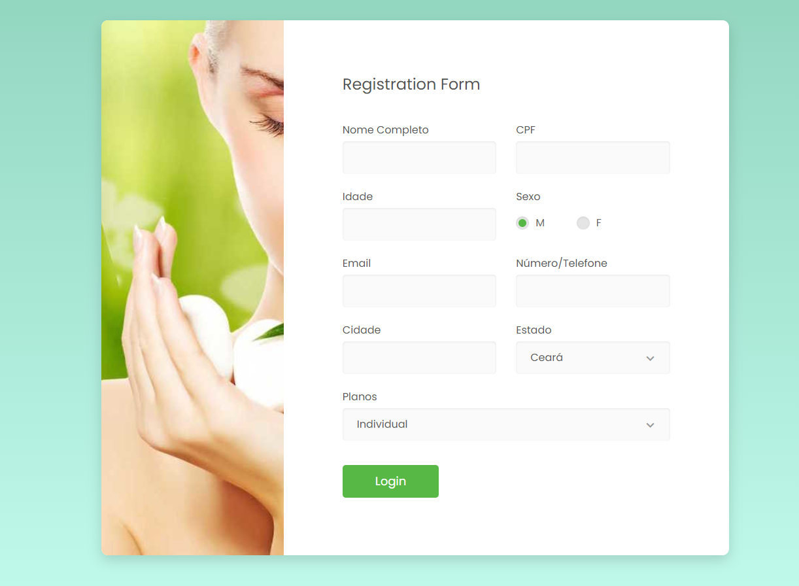
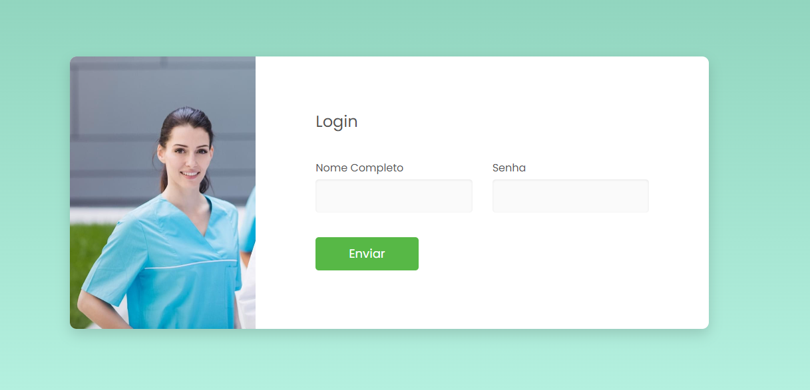

# Clinia de Estetica - Bem estar
<br>
**Um web site de uma clinica de estetica - ficticia**<br>
**Site Hospedado em 00webhost**<br> 
**Link : [Bem Estar](https://david-moom.000webhostapp.com/)**
 
## Indice

- <a href = "Layout">Layout</a>
- <a href="Tipos de Conversão">Cadastro</a>
- <a href="Tipos de Conversão">Login</a>

## 🔗 Layout
###  💻 Tela Inicial
> 

 <strong> O site consta de um layout caracteristico de um site de estica com carrousel e botões de login e Cadastro 🔁

> 

 <strong> Um pequeno formulario de de cadastro de clientes. 🔁

 > 

 <strong> A tela de login para clientes cadastrados por escolha apenas um cliente padrao foi cadastrado como adminstrador do banco de dados (). 🔁

 
## Instruçoes de Uso
```bash
# Faça um fork do projeto e Copie o link HTTPS e faça um git clone

$ git clone <link>

# No Eclipse em file > Open Projects from File System

# Clicar em Directory e localize o diretório do projeto "clonado"

# Abra a pasta HTML e Execute o arquivo bem_estar.hmtl em um navegador.
```
## 📚 Bibliotecas Utilizadas
1. [Bootstrap 5](https://getbootstrap.com/)
